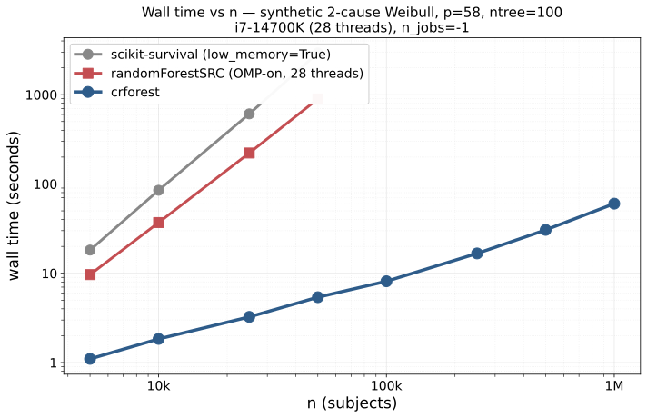

# crforest benchmarks

This is the full benchmark dossier for crforest. The repo's [README](../README.md)
links here for the detailed tables, methodology, and reproducibility scripts.

All numbers below are **measured**, not extrapolated, except where the
table cell says otherwise (e.g., sksurv extrapolations in the Scaling
section). Every benchmark has a reproducibility script in `validation/`
that any reviewer with the cited cohort access can rerun.

## vs randomForestSRC, matched-pair across hardware

Real CHF cohort, HF / death competing risks; n = 75 278 train / p = 58,
ntree = 100, leaf = 3, nsplit = 10, seeds 42–44 (mean wall):

| Hardware | crforest (`n_jobs=-1`) | rfSRC OMP-on | Speedup | RSS ratio |
|---|---|---|---|---|
| Apple M4 (10-core, 16 GB) | 9.42 s | 207.3 s | **22.0×** | — |
| Intel i7-14700K (28-thread, 32 GB) | **5.79 s** | 84.75 s | **14.6×** | 3.7× less |
| HPC Xeon Gold 6148 (32-core, 187 GB) | 5.61 s | 111.05 s | **19.8×** | 3.6× less |

Both libraries report HF C-index ≈ 0.85 at this workload — crforest
0.864 (cause-specific Wolbers concordance), rfSRC 0.847–0.849 (rfSRC's
own native cause-specific C from `err.rate`). These are computed from
different code paths and should not be subtracted directly; both are
well above paper-grade thresholds and confirm the libraries fit
similarly well. The 14–22× speedup band reflects how rfSRC's OpenMP
scales with per-core speed: the i7's high-clock P-cores benefit rfSRC
most, so the gap is smallest there; on slower-per-core HPC silicon the
gap widens. Reproducible via
[`validation/comparisons/n75k_path_b.py`](../validation/comparisons/n75k_path_b.py).

R-on-macOS users hit a separate scenario: rfSRC's OpenMP requires
rebuilding R against Homebrew gcc/clang, which most Mac R installs lack.
On a 10-core Apple M4, rfSRC built without OpenMP runs at ~895 s vs
crforest 9.42 s = **~95×** speedup at the default install path.

## Cross-dataset validation (SEER breast cancer)

n = 238 057 train / p = 17, ntree = 100, leaf = 3, nsplit = 10, seeds
42–44; HPC Xeon Gold 6148 (32 cores, 187 GB), full cohort matched-pair:

| Lib | Wall (mean ± std) | Peak RSS | Harrell C₁ | Harrell C₂ |
|---|---|---|---|---|
| crforest (`n_jobs=-1`) | **7.02 ± 0.31 s** | **8.83 GB** | 0.8652 | 0.8370 |
| rfSRC OMP-on (`rf.cores=32`) | 81.56 ± 3.40 s | 55.17 GB | 0.8450 | 0.8090 |
| Speedup / ratio | **11.6×** | **6.25× less** | — | — |

C-index columns are listed using each library's own native scorer
(crforest: cause-specific Wolbers concordance; rfSRC: native
`err.rate`-derived cause-specific C). They come from different code
paths and **should not be subtracted directly**; both report C ≈ 0.85
which is the durable claim. The SEER speedup (11.6×) is materially
smaller than CHF's 19.8× on the same HPC silicon because rfSRC's
per-split exhaustive scan scales with p, and SEER has ~3× fewer
features (p = 17 vs p = 58); the 10–22× cross-dataset band tracks p
directly. Reproducible via
[`validation/comparisons/seer_path_b.py`](../validation/comparisons/seer_path_b.py)
(requires your own SEER Research Data agreement; setup in
[`validation/comparisons/SEER_README.md`](../validation/comparisons/SEER_README.md)).

## Scaling on the synthetic Weibull DGP

Three libraries on identical synthetic data: crforest sub-linear
(≈ n^0.7), rfSRC and sksurv super-linear (rfSRC ≈ n^2.0, sksurv ≈ n^2.2).
At n = 50k crforest beats rfSRC by ~166× and sksurv by ~544× on this
DGP. The synthetic gap is much larger than what crforest delivers on
real EHR-shaped data (the [matched-pair section above](#vs-randomforestsrc-matched-pair-across-hardware)
reports 14–22× on CHF and 11.6× on SEER) — this is expected: synthetic
all-Gaussian features give rfSRC no fast path, while real EHR data is
binary-heavy, which rfSRC's exhaustive split scan handles relatively well.

## vs scikit-survival, paired same machine

i7-14700K, 28 threads, synthetic 2-cause Weibull DGP, p = 58, ntree =
100, both libraries at their best config (`n_jobs=-1`; sksurv
`low_memory=True`):

| n | sksurv `low_memory=True` | crforest | speedup |
|---|---|---|---|
| 5 000 | 18.2 s / 0.22 GB peak RSS | **1.10 s / 1.62 GB** | **16.6×** |
| 10 000 | 85.0 s / 0.26 GB | **1.84 s / 2.69 GB** | **46.2×** |
| 25 000 | 609.7 s / 0.37 GB | **3.25 s / 3.99 GB** | **187.6×** |
| 50 000 | 2 935.3 s (49 min) / 0.55 GB | **5.40 s / 5.67 GB** | **543.6×** |

The wall-time gap **widens** with n (sksurv RSF wall scales ≈ n^2.2 with
default `min_samples_leaf=3`; crforest histogram split kernel ≈ n^0.7).
At every paired point crforest also provides Aalen-Johansen CIF,
Nelson-Aalen CHF, and risk scores; sksurv `low_memory=True` provides
only `predict()` risk scores — `predict_cumulative_hazard_function` and
`predict_survival_function` raise `NotImplementedError`. When both are
scored on the single-event-collapsed truth sksurv is fit on, holdout
Harrell C-index is matched within ±0.01 across n; crforest additionally
surfaces a cause-specific Wolbers concordance of 0.69–0.72 for cause 1
(HF) that sksurv has no way to compute on competing-risk data. Sksurv's
other mode (`low_memory=False`) restores CHF/survival outputs but OOMs:
at n = 5k it already peaks at 16.8 GB RSS; at n = 10k it exceeds a 21.5
GB cap on a 24 GB host. Numbers reproducible via
[`validation/comparisons/sksurv_oom.py`](../validation/comparisons/sksurv_oom.py).

## Scaling (one-sided beyond the paired ranges)

Same consumer desktop as the paired benches above (i7-14700K, 28
threads). crforest exhibits sub-linear wall growth in n with the
histogram split kernel:

| Workload (default config, ntree = 100) | crforest CPU wall | rfSRC | sksurv |
|---|---|---|---|
| n = 75 000 (real CHF, paired on i7) | 5.79 s | 84.75 s | extrapolated ~2.4 hr (`low_memory=True`); `low_memory=False` exceeds 21.5 GB at n = 10k already |
| n = 238 057 (real SEER, paired on HPC) | 7.02 s | 81.56 s | extrapolated ~12 hr (n^2.2 from the n = 50k data point) |
| n = 1 000 000 (UKB-scale feasibility, on i7) | **63 s** | not measured (rfSRC peak RSS at n = 75 000 already 22.7 GB OMP-on; rfSRC's per-tree storage roughly doubles with n) | not feasible at full output capability |

The n = 1M number reproduces via
[`validation/spikes/lambda/exp5_paper_scale_bench.py`](../validation/spikes/lambda/exp5_paper_scale_bench.py).
We do not publish a paired number above n ≈ 100 000 because both R and
Python alternatives are impractical there, not because the comparison
gets unfavourable.

> Even when forced to `n_jobs=1`, crforest stays fast: the histogram
> split kernel is numba-compiled, so a single-thread fit uses the same
> hot loop as the parallel one (just without the joblib fan-out). That
> matters for environments where worker pools are forbidden — Jupyter
> notebooks under certain spawn configs, locked-down HPC schedulers,
> nested-parallel pipelines, etc.

The compact leaf storage (per-cause integer event/at-risk counts only;
CIF/CHF tables materialise lazily on first predict) keeps pickle size
proportional to the cohort: n = 100k, ntree = 100 pickles to ~5.0 GB.

## Reproducing every number

| Claim | Script | Cohort access required? |
|---|---|---|
| CHF matched-pair (3 hardware rows) | [`validation/comparisons/n75k_path_b.py`](../validation/comparisons/n75k_path_b.py) | Yes — see [`validation/spikes/kappa/exp1_chf_smoke.py`](../validation/spikes/kappa/exp1_chf_smoke.py) for the cohort vendoring step |
| SEER cross-dataset matched-pair | [`validation/comparisons/seer_path_b.py`](../validation/comparisons/seer_path_b.py) | Yes — own SEER Research Data agreement; setup in [`validation/comparisons/SEER_README.md`](../validation/comparisons/SEER_README.md) |
| sksurv comparison (4 n rows) | [`validation/comparisons/sksurv_oom.py`](../validation/comparisons/sksurv_oom.py) | No — synthetic DGP |
| n = 10⁶ scaling | [`validation/spikes/lambda/exp5_paper_scale_bench.py`](../validation/spikes/lambda/exp5_paper_scale_bench.py) | No — synthetic DGP |

For cross-library equivalence checks (bit-identical to rfSRC at fixed
seed via `equivalence="rfsrc"`), see
[`docs/equivalence-vs-rfsrc.md`](equivalence-vs-rfsrc.md).
